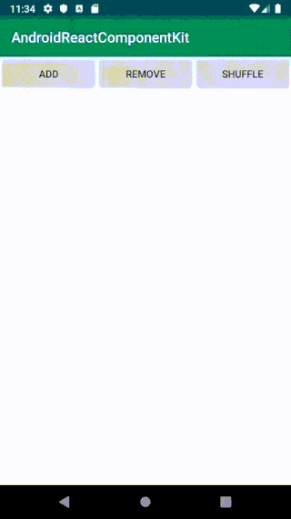
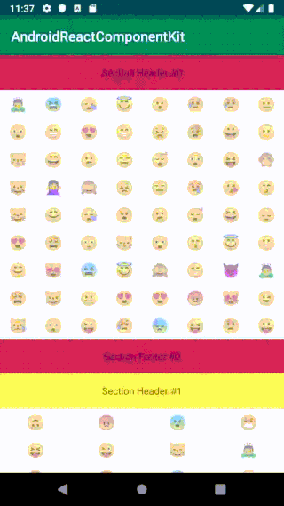

# AndroidReactComponentKit

[](http://developer.android.com/index.html)
[](https://android-arsenal.com/api?level=16)
[](http://opensource.org/licenses/MIT)

AndroidReactComponentKit is ReactComponentKit for Android. AndroidReactComponentKit is a library for building Activity or Fragment. You can make that based on Components. Also, It uses MVVM and Redux architectures for unidirectional data flow.

<div align="center"></div>

## Data Flow

 * (1) : Components dispatch actions
 * (2) : ViewModel passes the actions to the store. You can use beforeDispatch(action:) method to do some work before dispatching actions.
 * (3) : Store passes current state to the Redux pipeline. Middlewares, Reducers and Postwares make a new state.
 * (4) : New State comes out from the Redux pipeline. It is passed to the store.
 * (5) : Store passes the new state to the ViewModel.
 * (6) : ViewModel passes or propagates the new state to the Components.

## Components

AndroidReactComponentKit provides four components basically. 

 * ViewComponent
 	* ViewComponent is a view. It is an abstraction of the view that makes up the screen as a component. You can use ViewComponent to create a layout of the Activity or Fragment. It can also be used to create an item views in RecyclerView.
 * FragmentComponent
 	* FragmentComponet is a fragment. You can use FragmentComponent when creating an Activity. If you delegate responsibility for an Activity to a FragmentComponent, you can avoid creating a massive Activity.
 * RecyclerViewAdapter
 	* The RecyclerViewAdapter connects ViewComponent and RecyclerView. The RecyclerViewAdapter can use several types of views, but only one LayoutManager can be used.
 * CollectionViewAdapter
 	* The CollectionViewAdapter connects ViewComponent and RecyclerView. Unlike the RecyclerViewAdapter, you can use multiple LayoutManagers. In other words, you can use various LayoutManagers with different types of views.  

## Examples

### [Counter](https://github.com/ReactComponentKit/AndroidReactComponentKit/tree/master/app/src/main/java/com/github/skyfe79/android/library/app/examples/counter)

 
 
### [RecyclerView with DiffUtil](https://github.com/ReactComponentKit/AndroidReactComponentKit/tree/master/app/src/main/java/com/github/skyfe79/android/library/app/examples/emojicollection)
 
 
 
### [CollectionViewAdapter](https://github.com/ReactComponentKit/AndroidReactComponentKit/tree/master/app/src/main/java/com/github/skyfe79/android/library/app/examples/collectionview)

 
 
## Setup Gradle

```
dependencies {
	...
	implementation 'com.github.skyfe79.android:reactcomponentkit:0.0.1'
}
```

## MIT License

The MIT License (MIT)

Copyright (c) 2016 Sungcheol Kim, [https://github.com/ReactComponentKit/AndroidReactComponentKit](https://github.com/ReactComponentKit/AndroidReactComponentKit)

Permission is hereby granted, free of charge, to any person obtaining a copy
of this software and associated documentation files (the "Software"), to deal
in the Software without restriction, including without limitation the rights
to use, copy, modify, merge, publish, distribute, sublicense, and/or sell
copies of the Software, and to permit persons to whom the Software is
furnished to do so, subject to the following conditions:

The above copyright notice and this permission notice shall be included in all
copies or substantial portions of the Software.

THE SOFTWARE IS PROVIDED "AS IS", WITHOUT WARRANTY OF ANY KIND, EXPRESS OR
IMPLIED, INCLUDING BUT NOT LIMITED TO THE WARRANTIES OF MERCHANTABILITY,
FITNESS FOR A PARTICULAR PURPOSE AND NONINFRINGEMENT. IN NO EVENT SHALL THE
AUTHORS OR COPYRIGHT HOLDERS BE LIABLE FOR ANY CLAIM, DAMAGES OR OTHER
LIABILITY, WHETHER IN AN ACTION OF CONTRACT, TORT OR OTHERWISE, ARISING FROM,
OUT OF OR IN CONNECTION WITH THE SOFTWARE OR THE USE OR OTHER DEALINGS IN THE
SOFTWARE.


